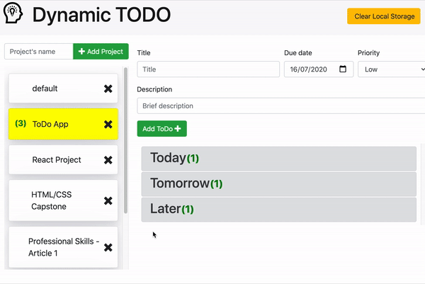

# The Todo List Web Application (Dynamic ToDo)

> Web Responsive application to create and organize a To-Do list using HTML/CSS and JavaScript



## Responsive design images


## Application features
- Organize list items in specific projects.
- Projects can be created and edited (name only).
- ToDo Items can be added to projects, including priority.
- Each Item can be fully edited, close or re-open dynamically.
- Projects and Item information is saved in the user's local storage
- Local storage can be clean for evaluation purposes (available only for demo) 

## Data Structure Design | OOP

- Each user session creates a 'book' object with an array of projects
- Each 'project' object has properties and an array of To-Do Item Object.
- Each Item Object contains basic properties like title, description, dueDate, priority and status.
- All data objects are created using Factory Functions organized in specific files (todobook.js, todoproject.js, todoitem.js) inside the ./src folder.
- Main Application functions are: stoprage (in charge of all storage actions), displaycontroller(in charge of rendering, and listeners generation). These functions are created using the module pattern, hosted in specific files (displaycontroller.js, storage.js)


## Built With

- JavaScript, HTML/CSS, Bootstrap
- Webpack, NPM
- VScode

## Live Demo

[Live Demo Link](https://livedemo.com)


## Getting Started


To get a local copy up and running, follow these simple example steps.

### Prerequisites
- To install the app in your system, make sure you have node/npm installed. [get npm](https://www.npmjs.com/get-npm)

### Setup
- Clone the repository in your system by using: 

``` git clone git@github.com:canriquez/JS_ToDo_App.git ```

### Install
- Next step is to CD into the local repository and run:

``` $ npm install ```  
``` $ npm run build ``` 


## Author

👤 ***Carlos Anriquez***

- Github: [@canriquez](https://github.com/canriquez)
- Twitter: [@cranriquez](https://twitter.com/cranriquez)
- Linkedin: [linkedin](https://www.linkedin.com/in/carlosanriquez/)
- Portfolio: [carlosanriquez.com](https://www.carlosanriquez.com)

👤 ***Xóchitl Selene Flores Pérez***

- Github: [@enelesmai](https://github.com/enelesmai)
- Twitter: [@enelesmai](https://twitter.com/enelesmai)
- Linkedin: [xochitlselene](https://linkedin.com/in/xochitlselene)

## 🤝 Contributing

Contributions, issues, and feature requests are welcome!

Feel free to check the [issues page](issues/).

## Show your support

Give a ⭐️ if you like this project!

## Acknowledgments

- Family, always my family.
- The Beagles!

## 📝 License

This project is [MIT](./LICENSE) licensed.